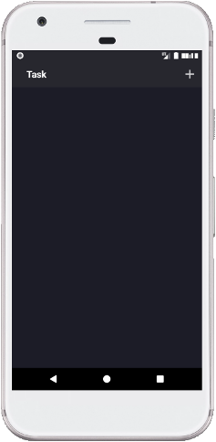
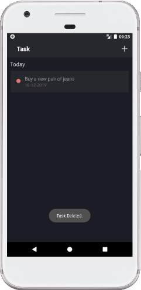

# ToDoTask
> An application that is your task list to-do.

## Table of contents
* [General info](#general-info)
* [Screenshots](#screenshots)
* [Technologies](#technologies)
* [Setup](#setup)
* [Status](#status)
* [Inspiration](#inspiration)
* [Contact](#contact)

## General info
This application is a list that allows you to add new tasks, update or delete them.

## Screenshots

## Technologies
* Java
* Android Studio

## Setup
Click "Clone or download", unzip files, open in Android Studio and configure virtual device to debug the app.

## Status
Project is: finished

## Inspiration
Youtube tutorial and college.
Project for studies.
Github.

## Contact
Created by Emil Grabowski emil.grabowski@interia.pl
